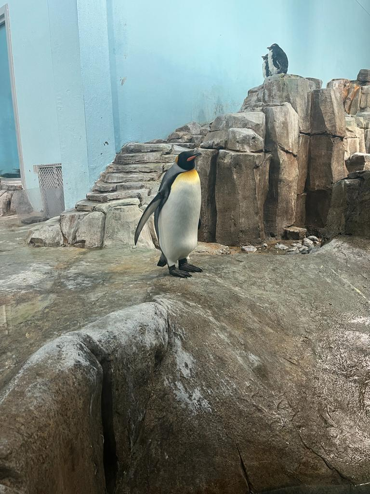
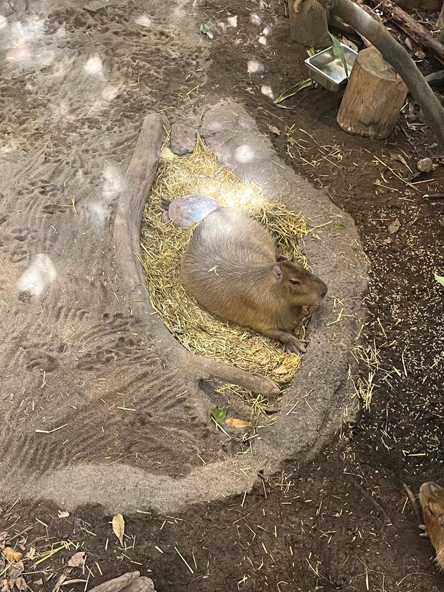
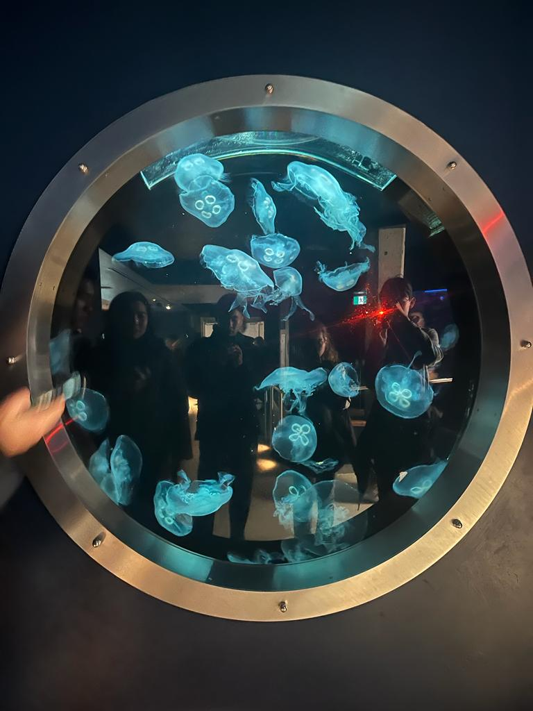

# **Elvis Joa's User Page**
## *Who Am [I](Me.jpg)?*
`alert("Hello, my name is Elvis")`

I am Mathematics-Computer Science student. I was born in New York, but grew up in Dominican Republic, so I am able to speak Spanish and English fluently. I came to San Diego mostly for college, and I plan to eventually find a job somewhere closer to family.

### Things I like:
1. Hobby: playing video games and running
2. Favorite Food: ice cream
3. Favorite show: Brooklyn Nine-Nine
4. Favorite quote from the show: 
   >“Cool, cool, cool, cool, cool. No doubt, no doubt, no doubt.” - Jake Peralta

## *What am I doing?*

 I am currently working on developing a CFG tester for [flap.js](https://flapjs.web.app/#), a tool used in CSE105 to draw DFAs, NFAs, and Turing Machines. Right now, I am learning Javascript as I continue to work on flap.js. I consider myself a good programmer in that I do not always find the most efficient method, but I believe I make up for it through effort and hardwork.

## *Spring Break*
 
 Over Spring Break, I went to the BioDome in Canada, and here are some of the animals I saw there:
* Penguin

* Capybara

* Jellyfish

## **Goals/Tasks I want to complete this quarter**
- [ ] Get more comfortable with Javascript
- [ ] Finish my CFG Tester on flap.js
- [ ] Learn to work with others on programming projects in flap.js and CSE110
- [ ] Have fun meeting new people
